

  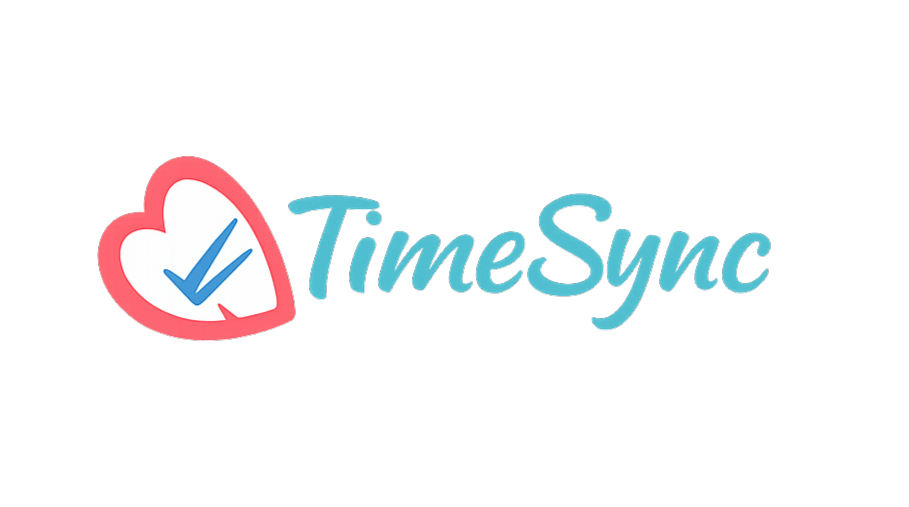

## 1. Overview

This application was developed as part of the KERN IT recruitment challenge. It is a timesheet management system that allows users to track the time they spend working on projects, manage project participation, and view activity through a dashboard.

## 2. Objectives

- Allow users to register, log in, and log out
- Allow users to create, view, edit, and delete their own time entries
- Allow users to search and filter their time entries
- Allow users to create and manage projects
- Allow project owners to manage project members
- Provide a dashboard with essential time-tracking and project activity information
- Support notifications for important project-related events

## 3. Assumptions

- Users must be able to create an account
- The dashboard should present activity summaries for the last 7 and 30 days, as well as weekly and monthly information
- Any authenticated user can create a project and becomes its owner
- A project owner can manage the project by editing its details, changing its visibility, archiving it, and adding or removing members
- Users can search for public projects and join them directly
- Users cannot join private projects directly; only the project owner can add them
- Users can add time entries either from the project page or from the My Entries page
- On the My Entries page, users can only view their own time entries
- On the Project Details page, regular members can only view their own entries for that project, while the project owner can view all entries for all project members
- Project owners should be able to view aggregated time information for project members by week or by month
- Users receive notifications when they are added to or removed from a project

## 4. Use Cases

### 1. TimeSync

#### 1.1 Manage User
- 1.1.1 Register User
- 1.1.2 Update User Profile
- 1.1.3 Recover Password
- 1.1.4 Log In
- 1.1.5 Log Out

#### 1.2 Manage Projects
- 1.2.1 Create Project
- 1.2.2 Update Project
- 1.2.3 View Projects with Search and Filters
- 1.2.4 View Project Details
- 1.2.5 View Own Project Time Entries
- 1.2.6 View All Project Members’ Time Entries (Project Owner)
- 1.2.7 View Project Members (Project Owner)
- 1.2.8 Update Project Members (Project Owner)
- 1.2.9 View Aggregated Time Report for All Members (Project Owner)
- 1.2.10 Archive Project (Project Owner)

#### 1.3 Manage Time Entries
- 1.3.1 View Own Time Entries with Search and Filters
- 1.3.2 Create Time Entry
- 1.3.3 Update Time Entry
- 1.3.4 Delete Time Entry
- 1.3.5 View Time Entry Details

#### 1.4 Manage Notifications
- 1.4.1 View Notifications
- 1.4.2 Mark Notification as Read
- 1.4.3 Receive Automatic Notification When Added to or Removed from a Project

## 5. Main Pages and UI Behavior

This section describes the main pages of the application, their purpose, key interface elements, user actions, and important behavior rules. The page descriptions are supported by UI mockups that illustrate the intended layout and interaction model of TimeSync.

### 5.1 Landing Page

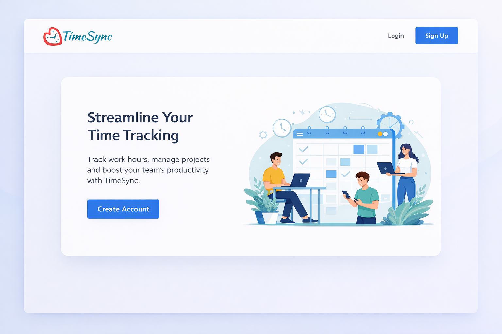

**Purpose**  
Serve as the public entry point of the application and introduce TimeSync to new users. This page gives unauthenticated users a quick understanding of the product and provides direct access to registration and login.

**Main UI Elements**
- TimeSync logo and branding
- Short application description
- Primary call-to-action button to create an account
- Navigation actions for login and sign up

**User Actions**
- Open the registration page
- Open the login page

**Behavior Notes**
- This page is intended for unauthenticated users only
- It should present a simple and welcoming introduction to the platform
- Basic visual animations or transitions may be used to improve the first impression, but they are optional and not part of the core business logic

### 5.2 Create Account Page

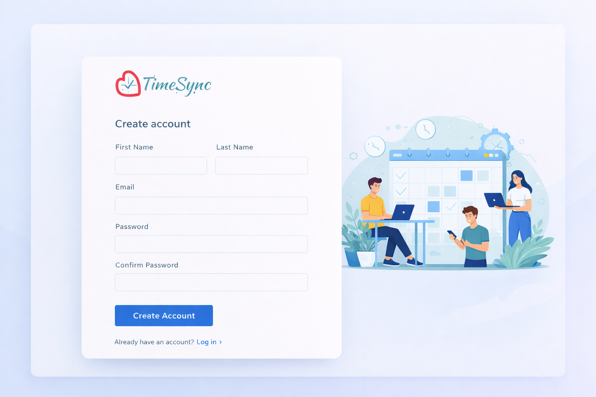

**Purpose**  
Allow a new user to register and create an account in order to access the application.

**Main UI Elements**
- Input fields for first name, last name, email, password, and password confirmation
- Primary action button to create the account
- Link to the login page for users who already have an account

**User Actions**
- Enter the required registration information
- Submit the registration form
- Navigate to the login page instead of registering

**Behavior Notes**
- All mandatory fields must be validated before account creation
- The email should be unique in the system
- The password should meet the required complexity rules
- Password and confirmation password must match before submission is accepted

### 5.3 Login Page

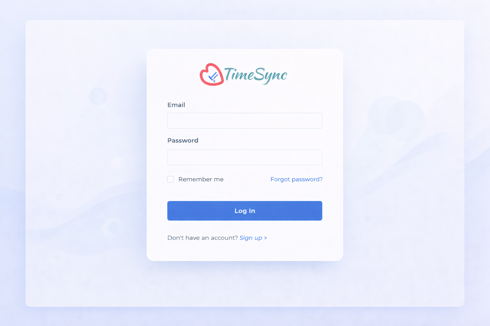

**Purpose**  
Allow an existing user to authenticate and access the application.

**Main UI Elements**
- Email field
- Password field
- Log In button
- Forgot Password link
- Sign Up link for users who do not yet have an account
- Optional Remember Me checkbox

**User Actions**
- Enter valid login credentials
- Submit the login form
- Navigate to password recovery
- Navigate to account registration

**Behavior Notes**
- Invalid credentials should display a clear validation or authentication error message
- Successful authentication should redirect the user to the dashboard

### 5.4 Application Layout and Navigation

**Purpose**  
Provide a consistent navigation structure across the authenticated area of the application.

**Main UI Elements**
- Left sidebar navigation
- Top header area with page title
- Bell icon for notifications
- User avatar/profile access
- Logout action

**User Actions**
- Navigate between the main authenticated pages
- Open the notifications dropdown from the bell icon
- Access the user menu
- Log out from the application

**Behavior Notes**
- The main sidebar items are:
  - Dashboard
  - Projects
  - My Entries
  - Logout
- Notifications are accessed from the bell icon in the top area, not as a permanent sidebar page
- The active page should be visually highlighted in the sidebar
- A red badge or dot may be shown on the bell icon when unread notifications exist

### 5.5 Dashboard Page

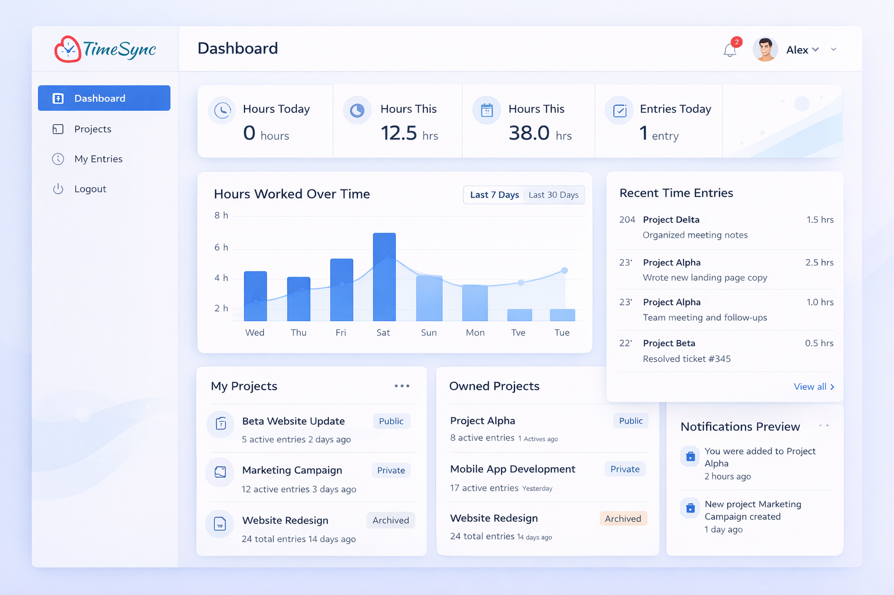

**Purpose**  
Provide the user with a quick overview of tracked time, recent activity, project participation, owned project activity, and recent notifications.

**Main UI Elements**
- Summary cards showing:
  - Hours Today
  - Hours This Week
  - Hours This Month
  - Entries Today
- “Hours Worked Over Time” chart
- Period toggle for recent time ranges such as last 7 days and last 30 days
- Recent time entries panel
- “My Projects” activity panel
- “Owned Projects” activity panel
- Notifications preview panel

**User Actions**
- Review personal time-tracking summaries
- Change the chart period using the available time filter
- Open relevant projects or entries from dashboard widgets
- Review recent notifications from the preview area or from the bell icon

**Behavior Notes**
- Dashboard data is personalized to the logged-in user
- “My Projects” reflects projects where the user is a member
- “Owned Projects” reflects projects created by the user
- Archived projects may still appear in activity sections for historical visibility

### 5.6 Projects Page

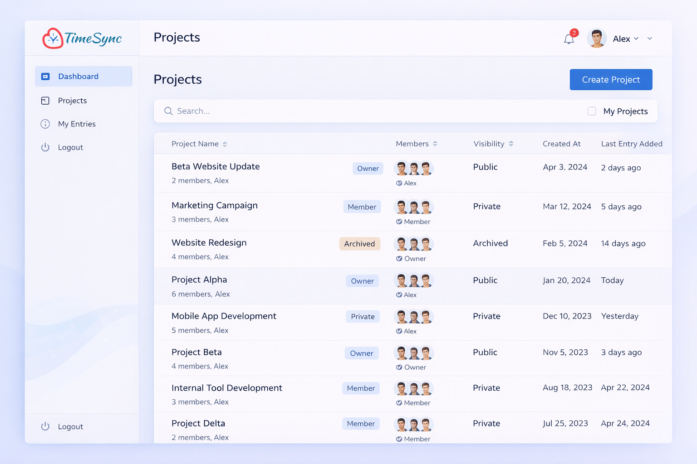

**Purpose**  
Display all projects in the system and allow the user to browse, search, filter, and create projects.

**Main UI Elements**
- Search bar
- “My Projects” checkbox filter
- Create Project button
- Projects table with columns for:
  - Project Name
  - Members
  - Visibility
  - Created At
  - Last Entry Added
- Relationship badge indicating whether the user is the Owner, a Member, or neither

**User Actions**
- Search projects by name
- Filter to show only projects related to the user
- Open a project from the table
- Open the create project form

**Behavior Notes**
- Public projects can be opened directly
- Private projects can be opened only by members
- If a non-member clicks a private project, the system should display a popup explaining that the project requires an invitation
- Archived projects remain visible in the list for audit and historical access
- The page is named **Projects**, not **My Projects**

### 5.7 Create Project Dialog

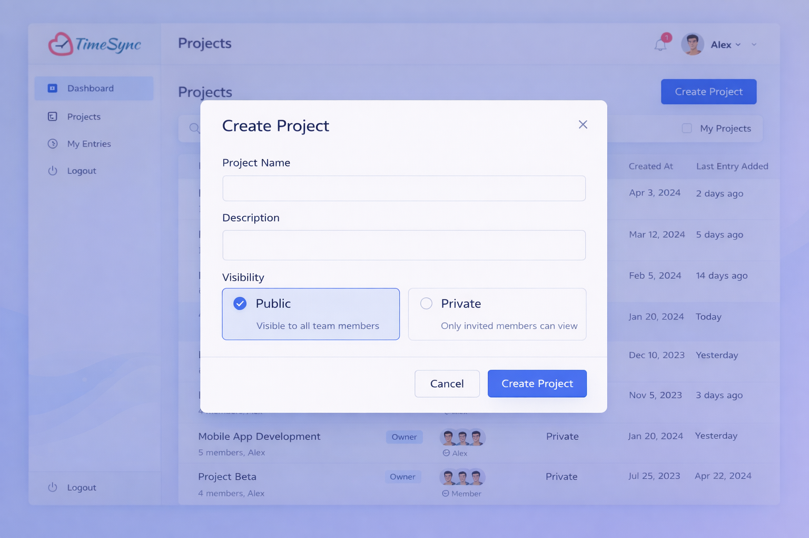

**Purpose**  
Allow an authenticated user to create a new project.

**Main UI Elements**
- Project name field
- Description field
- Visibility selector with Public and Private options
- Create Project button
- Cancel button

**User Actions**
- Enter the project information
- Select the project visibility
- Submit or cancel project creation

**Behavior Notes**
- This action is opened from the Projects page
- The creator becomes the project owner automatically
- Public projects can later be joined directly by other users
- Private projects require owner-managed membership
- The dialog is implemented as a modal on top of the Projects page

### 5.8 Project Details Page

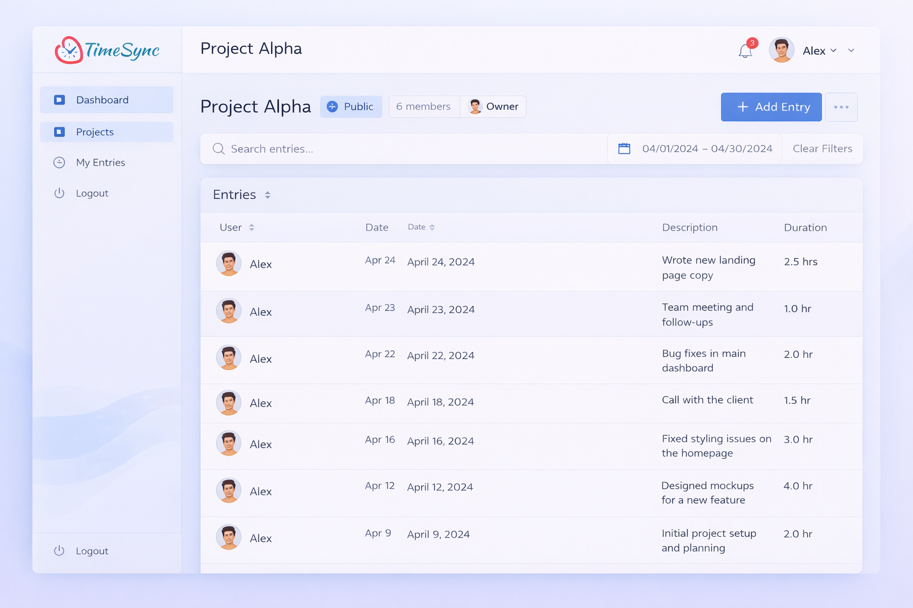

**Purpose**  
Present project-specific information and display time entries related to the selected project.

**Main UI Elements**
- Project title
- Visibility badge
- Members count
- Owner badge or ownership indicator
- Archived status when applicable
- Add Entry button
- Search input
- Date range filter
- Entries table

**User Actions**
- View project entries
- Search entries
- Filter entries by date range
- Add a new time entry if permitted
- Open member management if the user is the owner

**Behavior Notes**
- Regular members can view only **their own entries** for that project
- The project owner can view **all entries** for all members of the project
- A user filter may be available for the owner view
- The main action button behavior depends on state:
  - Public + not a member → **Join Project**
  - Member → **Add Entry**
  - Archived project → Add Entry hidden or disabled
- Owners should have access to the **Members** management flow

### 5.9 Private Project Access Popup

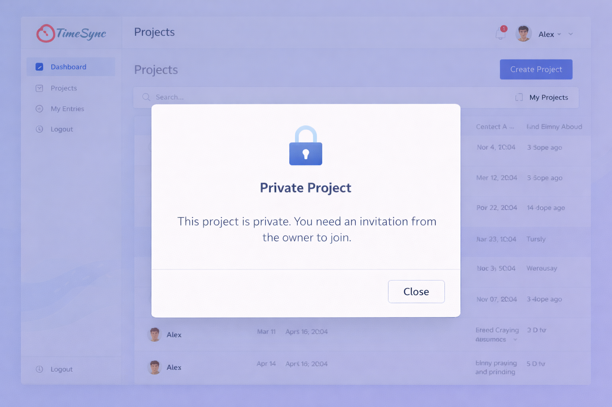

**Purpose**  
Inform the user that a private project cannot be accessed directly without being added by the owner.

**Main UI Elements**
- Modal popup
- Private project icon or message
- Explanatory text
- Close button

**User Actions**
- Close the popup and return to the Projects page

**Behavior Notes**
- This popup appears when a non-member attempts to open a private project
- It clearly communicates that the project is invitation-only
- No direct join action is offered for private projects under the current product rules

### 5.10 Project Members Page

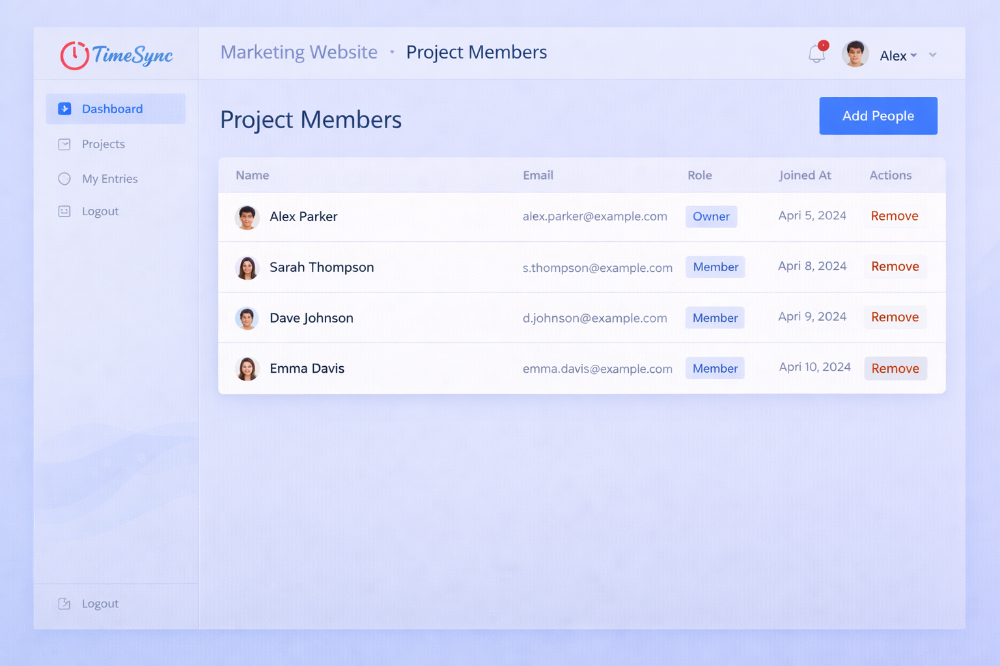

**Purpose**  
Allow the project owner to view and manage the project membership.

**Main UI Elements**
- Members table with:
  - Name
  - Email
  - Role
  - Joined At
  - Actions
- Add People button
- Remove action for members

**User Actions**
- View the current list of project members
- Remove members from the project
- Open the Add People flow

**Behavior Notes**
- This page is owner-only
- The owner cannot remove themselves from the project through this screen
- Removing a member should create a notification for that user
- Membership changes should remain audit-friendly

### 5.11 Add People to Project Dialog

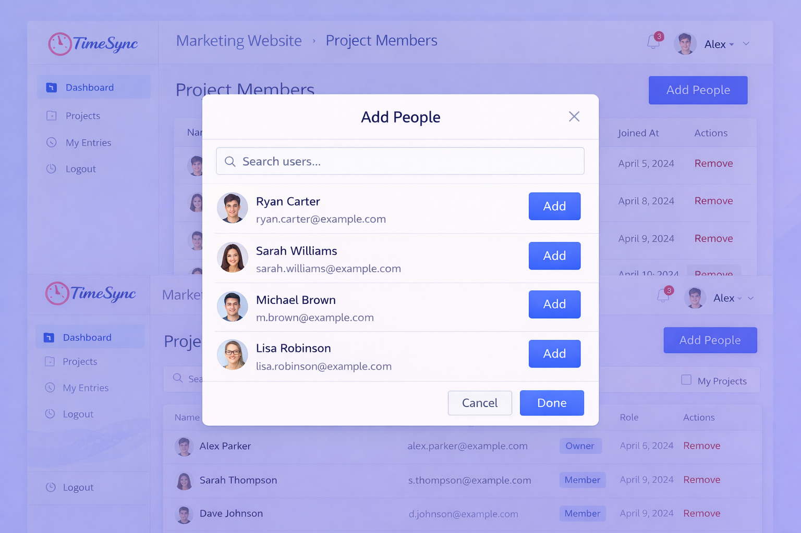

**Purpose**  
Allow the project owner to search for users and add them directly to the project.

**Main UI Elements**
- Search field for user lookup
- Search result list showing user name and email
- Add action for each result
- Cancel button
- Confirmation button

**User Actions**
- Search users by name
- Select one or more users to add
- Confirm or cancel the operation

**Behavior Notes**
- This flow is opened from the Project Members page
- Added users become project members immediately after confirmation
- A notification is created for each added user
- This is a direct add flow, not a request/approval invitation workflow

### 5.12 My Entries Page

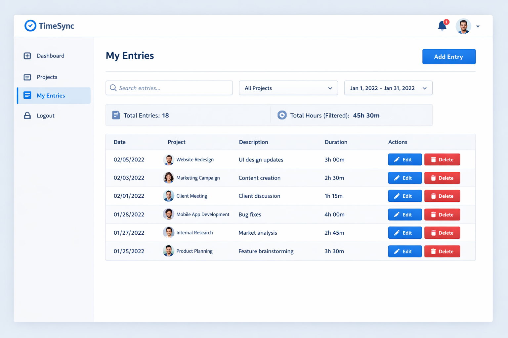

**Purpose**  
Allow the logged-in user to view and manage only their own time entries across all projects they belong to.

**Main UI Elements**
- Add Entry button
- Search field
- Project filter
- Date range filter
- Summary section showing:
  - Total entries
  - Total filtered hours
- Entries table with columns for:
  - Date
  - Project
  - Description
  - Duration
  - Actions

**User Actions**
- View personal time entries
- Search and filter entries
- Open the create entry dialog
- Edit an existing entry
- Delete an existing entry

**Behavior Notes**
- This page displays only entries belonging to the logged-in user
- Users can edit or delete only their own entries
- The summary values should update according to the active filters

### 5.13 Create Time Entry Dialog

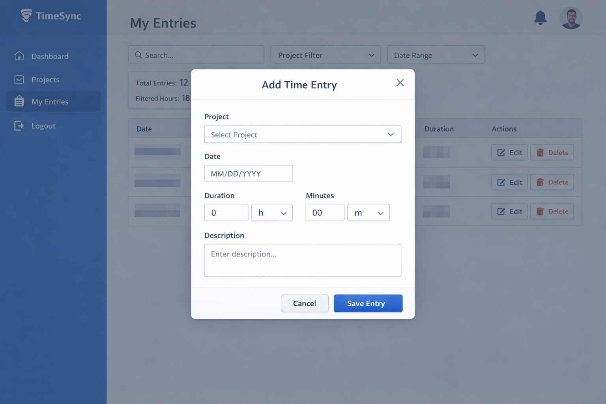

**Purpose**  
Allow the user to create a new time entry.

**Main UI Elements**
- Project selector
- Date field
- Duration input
- Description field
- Save Entry button
- Cancel button

**User Actions**
- Select a project
- Enter the work date
- Enter the duration
- Provide a short description
- Save or cancel the new entry

**Behavior Notes**
- Users can create entries only for projects they belong to
- Duration is stored internally as `duration_minutes`
- The dialog may be opened from either:
  - My Entries page
  - Project Details page
- Archived projects must not accept new time entries

### 5.14 Edit Time Entry Dialog

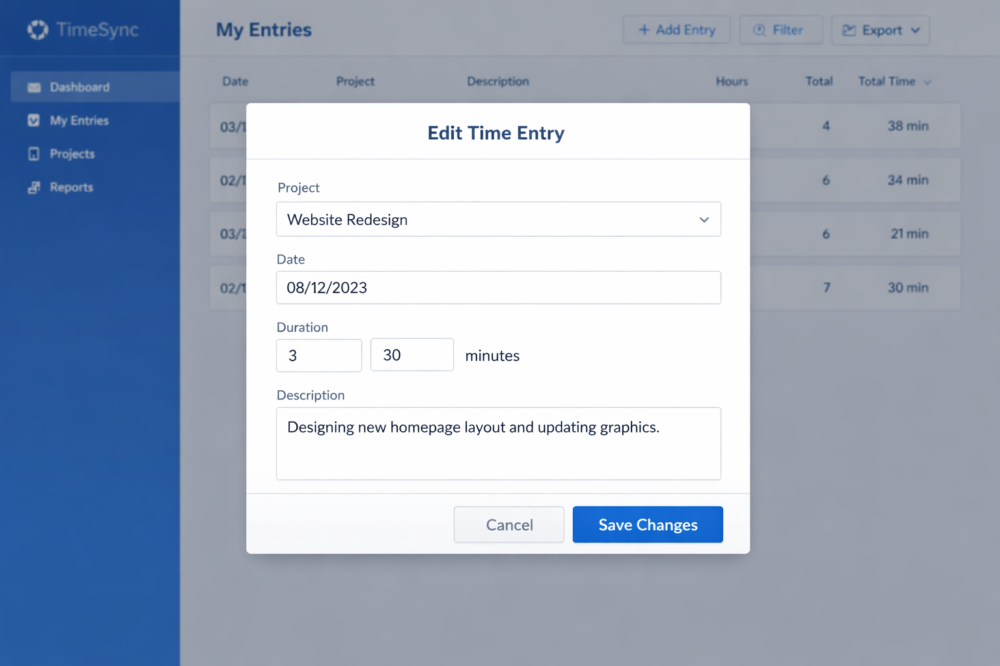

**Purpose**  
Allow the user to update the information of one of their existing time entries.

**Main UI Elements**
- Project selector or project display
- Date field
- Duration input
- Description field
- Save Changes button
- Cancel button

**User Actions**
- Modify entry details
- Save changes
- Cancel editing

**Behavior Notes**
- Only the owner of the time entry can edit it
- The same validation rules used for creation should also apply to editing

### 5.15 Notifications Dropdown

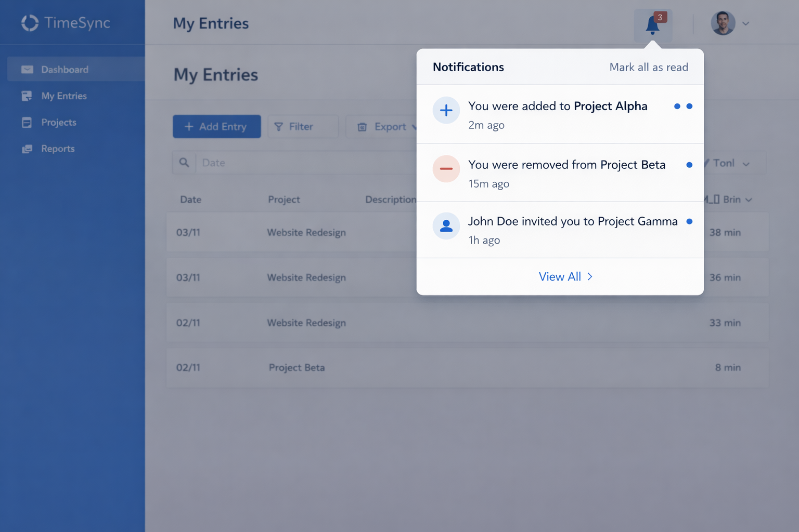

**Purpose**  
Provide quick access to the user’s most recent notifications from any authenticated page.

**Main UI Elements**
- Bell icon in the header
- Dropdown panel showing recent notifications
- Unread count badge
- Mark all as read action
- “View All” link

**User Actions**
- Open the notifications dropdown
- Review recent notifications
- Mark notifications as read
- Open the full notifications view if that page is included in the final design

**Behavior Notes**
- This is the primary notification access pattern defined in the agreed product scope
- Unread notifications should be visually distinct
- The dropdown shows only a recent subset, not the full notification history

### 5.16 Archive Project Confirmation Dialog

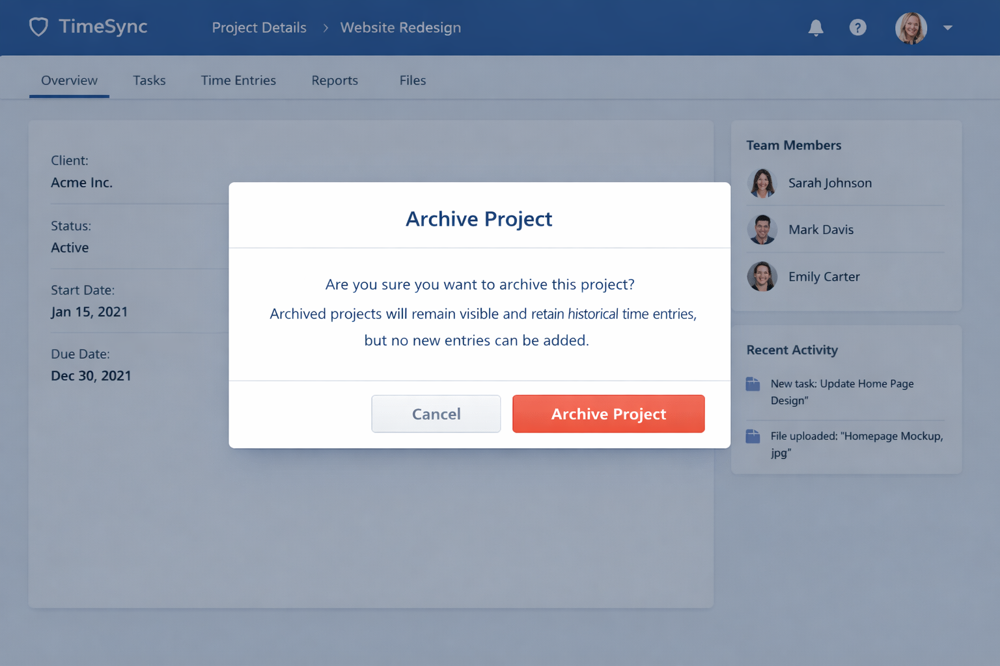

**Purpose**  
Allow the project owner to archive a project while clearly communicating the effect of that action.

**Main UI Elements**
- Confirmation modal
- Explanation text
- Cancel button
- Archive Project button

**User Actions**
- Cancel the archive operation
- Confirm project archival

**Behavior Notes**
- This action is owner-only
- The confirmation message should explain that archived projects:
  - remain visible
  - retain historical time entries
  - do not allow new entries
- This behavior supports the audit-friendly design of the system and avoids hard deletion of projects with recorded work

### 5.17 Notifications List Page

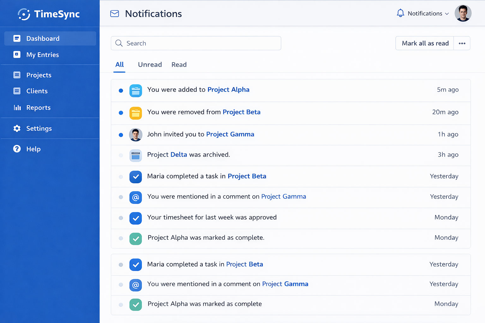

**Purpose**  
Display a fuller history of notifications and allow the user to search and filter them.

**Main UI Elements**
- Notifications list
- Search field
- Filter tabs or controls for:
  - All
  - Unread
  - Read
- Mark all as read action

**User Actions**
- Browse notifications
- Search notification text
- Filter by read status
- Mark all notifications as read
- Open a notification if navigation is supported

**Behavior Notes**
- This page can be included as an extended notification view linked from the notifications dropdown
- The core agreed design still treats notifications primarily as a **dropdown from the header**
- Opening an unread notification may automatically mark it as read

## 6. Architecture

TimeSync is designed as a web application composed of a frontend layer, a backend layer, and a relational database. The system follows a client-server architecture in which the frontend is responsible for the user interface, the backend is responsible for business logic and access control, and the database is responsible for persistent data storage.

### 6.1 Frontend

The frontend of TimeSync will be developed using **React**. Its main responsibility is to provide the user interface of the application and allow users to interact with the system in an intuitive way.

The frontend will render the main pages of the application, including the dashboard, projects page, project details page, members management page, and My Entries page. It will also handle form submission, filtering, navigation, modal dialogs, and notification interactions.

### 6.2 Backend

The backend of TimeSync will be implemented in **Python using Flask**. It will expose the server-side functionality of the application and act as the central layer for business logic and validation.

The backend will be responsible for processing user requests, enforcing business rules, validating permissions, and coordinating operations related to projects, memberships, time entries, and notifications. It will also ensure that privacy rules are respected, such as limiting regular members to their own project entries while allowing project owners to view all entries within their projects.

### 6.3 Database

The application will use **PostgreSQL** as its relational database management system.

PostgreSQL will store all persistent business data required by the application, including users, projects, project memberships, time entries, and notifications. It will support the relational structure of the system and provide reliable data consistency for multi-user operations.

### 6.4 Communication Between Frontend and Backend

Communication between the frontend and backend will be performed through **REST API** calls.

The React frontend will send HTTP requests to the Flask backend whenever the user performs an action, such as logging in, creating a project, joining a public project, adding a time entry, or managing project members. The backend will process the request, interact with the database when needed, and return structured responses to the frontend.

### 6.5 Authentication and Authorization

Authentication will be handled on the backend using a **Flask authentication library**.

This layer will be responsible for validating user credentials, protecting restricted endpoints, and managing authenticated access to the application. It will also support authorization checks to ensure that users can only perform actions they are allowed to perform, such as editing their own entries, managing projects they own, or accessing private project information only when they are members.

### 6.6 Deployment

To simplify setup and execution across different environments, the application will be deployed using **Docker**.

Containerization will make it easier to run the application on different computers with a consistent configuration. This approach reduces setup effort, helps standardize the runtime environment, and improves portability for development, testing, and demonstration purposes.

## 7. Database Model

The database model of TimeSync is designed to support a multi-user timesheet application with project ownership, project membership, time tracking, notifications, and audit-friendly data retention.

The following entity-relationship diagram illustrates the main database tables and the relationships between them.

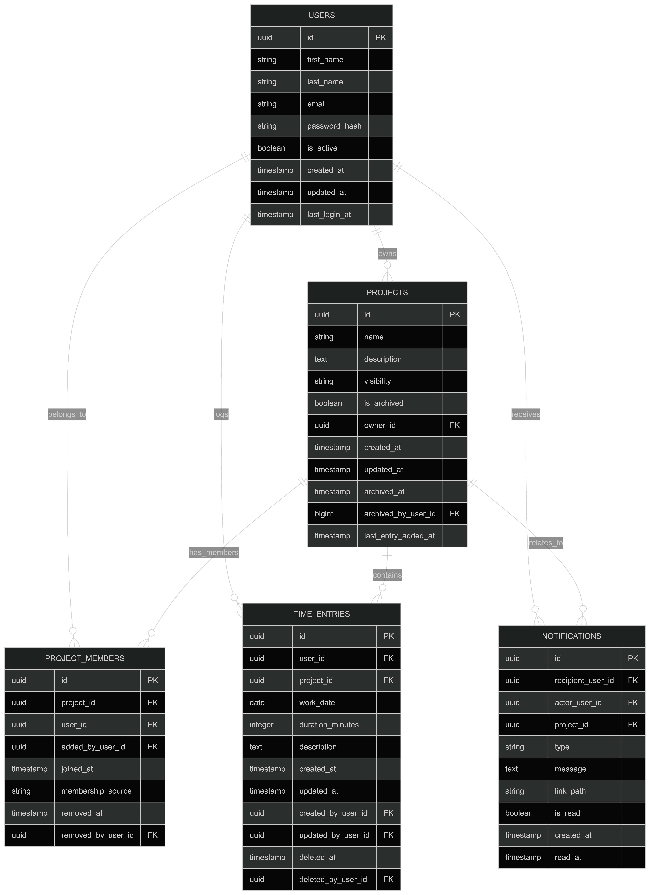

The model is centered around five main entities: **users**, **projects**, **project_members**, **time_entries**, and **notifications**.

Key design decisions reflected in the model include:
- A user can own multiple projects
- A user can belong to multiple projects through the `project_members` table
- A project can contain multiple time entries
- Each time entry belongs to one user and one project
- Notifications are linked to a recipient user and may also reference an actor user and a related project
- Audit-related fields such as `archived_at`, `removed_at`, and `deleted_at` are included to preserve historical information instead of relying only on hard deletion

## 8. API Overview

The TimeSync frontend communicates with the backend through a REST API. This API is responsible for supporting the main operations of the system, including authentication, project management, member management, time entry handling, dashboard data retrieval, and notifications.

Since this document is a functional and technical specification, the goal of this section is not to define every request and response in detail, but rather to present the main API areas that the backend is expected to provide in order to support the application.

### 8.1 Authentication

The authentication layer is responsible for allowing users to register, log in, log out, and recover access to their accounts when needed.

Typical endpoints in this area would include:
- `POST /auth/register` to create a new account
- `POST /auth/login` to authenticate a user
- `POST /auth/logout` to end the current session
- `POST /auth/forgot-password` to initiate password recovery
- `POST /auth/reset-password` to define a new password
- `GET /auth/me` to return information about the authenticated user

These endpoints support the basic account lifecycle and ensure that access to protected parts of the application is limited to authenticated users.

### 8.2 Projects

The projects API is responsible for the creation and management of projects, as well as for listing and retrieving project information.

Expected endpoints include:
- `GET /projects` to retrieve the list of projects, with support for search and filters
- `POST /projects` to create a new project
- `GET /projects/{projectId}` to retrieve the details of a specific project
- `PUT /projects/{projectId}` to update project information
- `PATCH /projects/{projectId}/visibility` to change the project between public and private
- `PATCH /projects/{projectId}/archive` to archive a project
- `POST /projects/{projectId}/join` to allow a user to join a public project

These endpoints must respect the rules defined for project ownership and visibility. In particular, only public projects can be joined directly, while private projects remain accessible only to their members.

### 8.3 Project Members

Project membership is managed separately from general project information, since it involves owner-only actions and role-sensitive behavior.

The main endpoints in this area would include:
- `GET /projects/{projectId}/members` to view the members of a project
- `POST /projects/{projectId}/members` to add users directly to the project
- `DELETE /projects/{projectId}/members/{userId}` to remove a member from the project

These operations should be restricted to the project owner. They should also trigger notifications whenever a user is added to or removed from a project.

### 8.4 Time Entries

Time entry endpoints support the core time-tracking functionality of the application.

Expected endpoints include:
- `GET /time-entries` to return the authenticated user’s own entries, with optional filters
- `POST /time-entries` to create a new entry
- `GET /time-entries/{entryId}` to retrieve the details of a specific entry
- `PUT /time-entries/{entryId}` to update an existing entry
- `DELETE /time-entries/{entryId}` to remove an entry using the defined audit-friendly approach
- `GET /projects/{projectId}/time-entries` to retrieve entries associated with a given project

This part of the API must enforce some of the most important business rules of the application. A user may only create entries for projects they belong to, and may only edit or delete their own entries. In project-specific views, regular members should only receive their own entries, while the project owner may retrieve all entries for that project.

### 8.5 Notifications

The notifications API supports the bell dropdown and, if included, a fuller notification list view.

Typical endpoints include:
- `GET /notifications` to return the authenticated user’s notifications
- `PATCH /notifications/{notificationId}/read` to mark one notification as read
- `PATCH /notifications/read-all` to mark all notifications as read
- `GET /notifications/unread-count` to return the number of unread notifications

These endpoints allow the frontend to show recent notifications, unread badges, and read-status updates in a simple and consistent way.

### 8.6 Dashboard Data

The dashboard requires aggregated information rather than only raw records, so it is useful to expose dedicated endpoints for this part of the application.

Possible endpoints include:
- `GET /dashboard/summary` to return values such as hours today, hours this week, hours this month, and entries today
- `GET /dashboard/activity` to return the data used in the time chart
- `GET /dashboard/recent-entries` to return the user’s most recent time entries
- `GET /dashboard/projects` to return project-related activity for both owned projects and joined projects
- `GET /dashboard/notifications-preview` to return a small recent subset of notifications

This approach keeps the frontend simpler, since it can retrieve pre-aggregated dashboard data directly from the backend instead of assembling it manually from several unrelated endpoints.

### 8.7 General Considerations

All API responses should follow a consistent JSON structure and return clear status codes so that the frontend can handle both successful operations and validation errors in a predictable way.

At a general level, the API should ensure that:
- protected operations require authentication
- permissions are enforced on the backend
- filters and search parameters are available where relevant
- archived projects remain visible for historical purposes but do not accept new time entries
- user feedback can be supported through clear and meaningful error responses

Overall, the API should remain simple and practical, while still covering the key functional needs of the application.

## 9. Business Rules

This section brings together the main rules that govern the behavior of the system. These rules must be enforced consistently by the backend and reflected in the frontend behavior.

### 9.1 Authentication and Access
- Users must be authenticated to access the main application features
- Only authenticated users can create projects, join public projects, create time entries, and view their personal dashboard data
- Public landing, registration, login, and password recovery pages remain accessible without authentication

### 9.2 Project Ownership
- Any authenticated user can create a project
- The user who creates the project automatically becomes its owner
- Each project has exactly one owner
- The owner is responsible for managing project settings, visibility, archival, and membership

### 9.3 Project Visibility
- A project can be either public or private
- Public projects can be viewed in the projects list and joined directly by authenticated users
- Private projects can also appear in the projects list, but users who are not members cannot open their details
- When a non-member attempts to open a private project, the system must show a message indicating that the project requires an invitation
- The project owner may change the visibility of a project after creation

### 9.4 Project Membership
- A user may belong to multiple projects
- A project may contain multiple members
- Public projects may be joined directly by authenticated users
- Private projects cannot be joined directly
- Only the project owner may add users directly to a private or public project through the member management flow
- Only the project owner may remove members from a project
- The owner cannot remove themselves from their own project through normal member management actions

### 9.5 Time Entry Ownership and Permissions
- Each time entry belongs to exactly one user and one project
- A user may create multiple time entries on the same date
- Users may only create time entries for projects they belong to
- Users may only edit their own time entries
- Users may only delete their own time entries
- Time duration is stored in minutes using the `duration_minutes` field

### 9.6 Time Entry Visibility
- The My Entries page must show only the logged-in user’s own entries
- On the Project Details page, regular project members may see only their own entries for that project
- On the Project Details page, the project owner may see all entries belonging to all members of that project
- Any project-level filtering or reporting must respect these visibility rules

### 9.7 Archived Projects
- Projects with historical work should not be hard-deleted
- Instead, they should be archived
- Archived projects remain visible in project listings and project details
- Archived projects preserve their historical time entries and membership history
- Archived projects do not accept new time entries
- The archive action is restricted to the project owner

### 9.8 Notifications
- Notifications are system-generated and are not part of a chat feature
- A notification should be created when a user is added to a project
- A notification should be created when a user is removed from a project
- Notifications belong to a recipient user and may also reference an actor user and a related project
- Users should be able to mark notifications as read individually or in bulk

### 9.9 Search and Filtering
- Projects should support search and filtering on the Projects page
- Personal time entries should support search and filtering on the My Entries page
- Project time entries should support search and date filtering on the Project Details page
- Filtering and search results must always respect the user’s permissions and visibility level

### 9.10 Audit-Friendly Behavior
- Important historical actions should remain traceable in the system
- The system should preserve meaningful timestamps and actor references where appropriate
- Destructive deletion should be avoided when it would remove relevant business history
- Project, membership, and time entry behavior should align with the audit-oriented design of the application

## 10. Audit and Data Retention Decisions

TimeSync is designed with a simple but deliberate audit-friendly approach. Even though the application is being developed as a coding challenge project, the data model and system behavior aim to preserve historical information whenever that information represents meaningful business activity.

### 10.1 Projects Are Archived Instead of Deleted

Projects may contain important historical records, including time entries, membership changes, and ownership information. For that reason, the preferred approach is to archive projects instead of deleting them.

Archiving allows the project to remain visible in the system while preventing further active use. This preserves the history of work already recorded and avoids losing relevant information.

### 10.2 Historical Time Entries Should Be Preserved

Time entries represent work that has already been recorded and should therefore be treated as historical business data. Rather than relying only on hard deletion, the data model includes soft-delete fields such as `deleted_at` and `deleted_by_user_id`.

This approach makes it possible to preserve traceability while still allowing the system to hide deleted entries from normal user views.

### 10.3 Membership Changes Should Remain Traceable

Project membership may change over time, but those changes can still be important from a historical perspective. For that reason, the `project_members` table includes fields such as `removed_at` and `removed_by_user_id`.

This allows the system to record when a member was removed and who performed that action, instead of completely erasing the membership history.

### 10.4 Important Timestamps Support Traceability

The schema includes several timestamps that help describe the lifecycle of records, such as:
- `created_at`
- `updated_at`
- `archived_at`
- `joined_at`
- `removed_at`
- `deleted_at`
- `read_at`

These fields improve traceability and make it easier to understand when important actions took place.

### 10.5 Auditability Was Preferred Over Destructive Simplicity

Where a choice had to be made between simplicity and historical preservation, the design generally favors preserving meaningful records. This is especially visible in the archive behavior for projects and the soft-delete approach for time entries.

## 11. Jira / Delivery Organization

The implementation of TimeSync can be organized in Jira by grouping the work into features derived from the defined use cases and main interfaces of the application. Based on those features, user stories can then be created to represent the individual development tasks required for each part of the system, such as authentication, projects, project membership, time entries, dashboard behavior, notifications, and deployment. 

JIRA link : 

## 12. Out of Scope

To keep the project focused and realistic for the challenge, some features are intentionally excluded from the current scope.

The following items are considered out of scope for the current version of TimeSync:
- Advanced role models beyond project owner and regular member
- Approval-based invitation workflows for joining projects
- Chat or comment functionality inside projects
- File attachments in projects or time entries
- Advanced reporting exports such as PDF or spreadsheet generation
- Calendar integrations with external platforms
- Mobile-native applications
- Billing, invoicing, or payroll features
- Real-time collaboration features such as live updates through websockets
- Permanent deletion flows for projects with historical work
